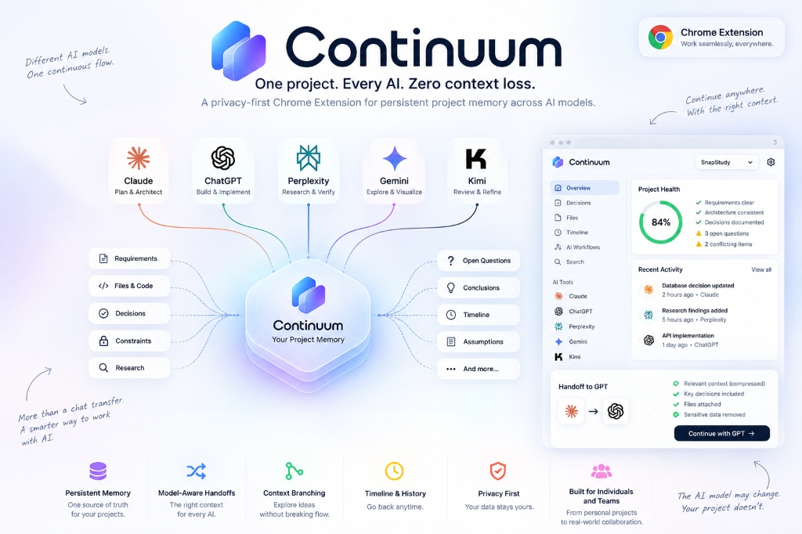

# Continuum 🌌

> **AI Context OS — One Project. Every AI. Zero Context Loss.**



**Continuum** is a browser extension that acts as a universal context memory layer for developers, researchers, and creators using multiple AI platforms. When switching between ChatGPT, Claude, Gemini, Perplexity, DeepSeek, and other LLMs, project context usually gets lost or fragmented. Continuum captures, structures, and compiles your project's decisions, requirements, constraints, and research into a single canonical source of truth—delivering model-optimized context handoffs with zero privacy leaks.

---

## 🌟 Key Features

- **🧠 Universal Memory Engine**: Automatically captures and categorizes key project knowledge into canonical memory entities (Decisions, Requirements, Constraints, Open Questions, Research Findings, and Files).
- **⚡ Model-Aware Context Compiler**: Intelligently tailors context handoffs specifically optimized for the target AI model (e.g., detailed architectural reasoning for Claude, file-centric context for ChatGPT/DeepSeek, research verification for Perplexity).
- **🔒 Secret Redaction Engine**: Built-in security layer that automatically detects and redacts sensitive data (API keys, credentials, tokens, PII) before context handoffs leave your browser.
- **⚖️ Conflict Resolution Engine**: Detects contradictory decisions, outdated requirements, or competing constraints across conversations and flags them for resolution.
- **📦 Project Passport (`.continuum`)**: Portable JSON export/import system to share full project context across devices or collaborate with team members.
- **🖥️ Native Side Panel UI**: Feature-rich Chrome side panel interface built with React 19, Tailwind CSS, and Lucide icons for managing project state in real-time.
- **⌨️ Command Palette & Global Shortcuts**: Quick access keyboard shortcuts for instant context capturing, side panel toggling, and global search.
- **🛡️ 100% Privacy & Local-First**: All data is stored locally in your browser using IndexedDB (`Dexie.js`). No external servers, no tracking.

---

## 🤖 Supported AI Platforms

Continuum seamlessly integrates via content scripts and custom context injection across major AI providers:

| Provider | Supported Domain | Specialized Role & Emphasis |
| :--- | :--- | :--- |
| **Claude** | `claude.ai` | Senior Architect & Systems Designer (Reasoning & Trade-offs) |
| **ChatGPT** | `chatgpt.com`, `chat.openai.com` | Senior Implementation Engineer (Detailed File Structure) |
| **Gemini** | `gemini.google.com` | Multimodal Analyst & Structured Thinker |
| **Perplexity** | `perplexity.ai` | Research Analyst & Fact-Checker (Verified Claims) |
| **DeepSeek** | Configurable / Compatible | Deep Implementation Engineer |
| **Kimi / Grok** | Configurable / Compatible | Code Reviewer & Problem Solver |

---

## ⚙️ Architecture & Tech Stack

Continuum is built with modern, high-performance web standards:

- **Framework & UI**: [React 19](https://react.dev/), [Tailwind CSS](https://tailwindcss.com/), [Lucide React](https://lucide.dev/)
- **Extension Infrastructure**: Chrome Extension Manifest V3, `@crxjs/vite-plugin`
- **Build System**: [Vite 6](https://vitejs.dev/), [TypeScript 5.6](https://www.typescriptlang.org/)
- **Local Storage**: [Dexie.js](https://dexie.org/) (IndexedDB wrapper)
- **State Management**: [Zustand](https://github.com/pmndrs/zustand)
- **Testing**: [Vitest](https://vitest.dev/)

---

## ⌨️ Keyboard Shortcuts

| Shortcut | Action |
| :--- | :--- |
| `Alt + C` | Toggle Continuum Side Panel |
| `Ctrl + Shift + Space` | Open Command Palette |
| `Ctrl + Shift + C` | Capture Conversation |

---

## 🛠️ Installation & Setup

### Prerequisites

- [Node.js](https://nodejs.org/) (v18 or higher recommended)
- `npm` or `pnpm` / `yarn`
- Chrome or Chromium-based browser (Brave, Edge, Arc)

### Local Development Setup

1. **Clone the repository**:
   ```bash
   git clone https://github.com/your-username/continuum.git
   cd continuum
   ```

2. **Install dependencies**:
   ```bash
   npm install
   ```

3. **Start development build** (with HMR):
   ```bash
   npm run dev
   ```

4. **Build production bundle**:
   ```bash
   npm run build
   ```

### Loading Extension into Chrome

1. Open Chrome and navigate to `chrome://extensions/`.
2. Enable **Developer mode** in the top right corner.
3. Click **Load unpacked**.
4. Select the `dist` directory in your project root.

---

## 📁 Project Structure

```
Continuum/
├── manifest.json              # Chrome Extension Manifest V3 configuration
├── vite.config.ts             # Vite build & CRX plugin configuration
├── tailwind.config.ts         # Tailwind CSS design system tokens
├── tsconfig.json              # TypeScript configuration
├── src/
│   ├── ai/                    # AI Engine core
│   │   ├── compiler/          # Model-aware ContextCompiler & token manager
│   │   └── extraction/        # Automated MemoryExtractor from conversations
│   ├── background/            # Chrome Service Worker scripts
│   ├── content/               # Provider content scripts (ChatGPT, Claude, Gemini, etc.)
│   ├── core/                  # Core domain engines
│   │   ├── conflicts/         # ConflictEngine for contradictory data
│   │   └── passport/          # .continuum Passport export/import system
│   ├── database/              # Dexie.js IndexedDB schema & repositories
│   ├── popup/                 # Quick extension popup view
│   ├── security/              # Security & RedactionEngine
│   ├── shared/                # TypeScript types, constants, utilities
│   └── sidepanel/             # Full React Sidepanel Application (Pages, Store, Components)
```

---

## 🧪 Development Scripts

- `npm run dev`: Start Vite development server with hot module replacement.
- `npm run build`: Compile TypeScript and build production extension package into `dist/`.
- `npm run test`: Run unit test suite using Vitest.
- `npm run test:watch`: Run Vitest in watch mode.
- `npm run lint`: Run ESLint check across source files.
- `npm run format`: Format source code using Prettier.

---

## 📄 License

This project is licensed under the [MIT License](LICENSE).